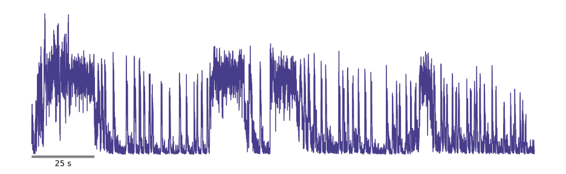

Face Motion Computation
=======================

To monitor movement within specific regions of interest in mouse muzzles, FaceIt employs image processing techniques to analyze motion energy over time. To evaluate the dynamic behavior of the mouse muzzle, FaceIt calculates the mean of the squared differences between consecutive frames in predefined areas. The motion energy, represented by :math:`E` is computed based on the formula below:

.. math::

   E = \frac{1}{N} \sum_{i=1}^{N} \left( I_{i}^{(t)} - I_{i}^{(t-1)} \right)^2

In this equation:

- :math:`E` denotes the motion energy value.
- :math:`N` represents the total number of pixels in the region of interest.
- :math:`I_{i}^{(t)}` is the intensity of the :math:`i`-th pixel in the current frame at time :math:`t`.
- :math:`I_{i}^{(t-1)}` indicates the intensity of the same pixel in the previous frame at time :math:`t-1`.

This approach generates a temporal profile of motion intensity, facilitating the analysis of changes in movement across consecutive frames.

The plot represents the motion energy measured over time for a single session recording. The x-axis displays time in seconds, while the y-axis shows the motion energy levels.

Motion Energy Computation Method Details
~~~~~~~~~~~~~~~~~~~~~~~~~~~~~~~~~~~~~~~~

The method responsible for performing these steps is documented as follows:

.. py:method:: motion_Energy_comput(images)

The function is located in the FACEIT_codes.analysis module.

**Method Overview**:

This method computes motion energy from a sequence of image frames, assessing the mean squared differences between consecutive frames in a predefined region of interest (ROI).

**Parameters**:
    - ``images`` (list): List of image arrays to process.

**Operation**:
    The method iterates through image frames, extracts the ROI, and computes motion energy as the mean of squared differences between the current and previous ROIs. This produces a temporal profile of motion intensity.

**Returns**:
    - ``motion_energy_values`` (list): List of computed motion energy values, representing the intensity profile over time.

.. important::

   The first frame's energy is duplicated at the start of the output list to maintain the correct data length.

Grooming Detection
~~~~~~~~~~~~~~~~~~

Grooming activity during recording can introduce anomalies into the motion energy data, leading to outliers in the frames associated with grooming behavior and potentially skewing the final analysis of motion energy.
To address this issue, FaceIt offers a manual grooming detection feature that allows users to set a threshold for motion energy directly within the GUI. This user-defined threshold helps identify and manage grooming frames effectively.

Grooming Detection Method Details
~~~~~~~~~~~~~~~~~~~~~~~~~~~~~~~~~

To address the challenge of identifying grooming activity in motion energy analysis, **FaceIt** includes a method called:

.. py:method:: remove_grooming(grooming_thr, facemotion)
which can be found in the FACEIT_codes.

This method processes motion energy data to cap values that exceed a user-defined threshold, effectively detecting and handling grooming behavior during recordings. Below is a detailed explanation of how this method works:

**Parameters**:
    - ``grooming_thr`` (float): Threshold for detecting grooming in motion energy data.
    - ``facemotion`` (array-like): Array of facial motion data to be processed.

**Operation**:
    The method identifies indices in ``facemotion`` that exceed ``grooming_thr`` and caps those values to reduce outliers associated with grooming activity. This results in a modified array, ``facemotion_without_grooming``, which facilitates clearer motion energy analysis.

**Returns**:
    - ``facemotion_without_grooming`` (np.ndarray): Array with values capped at the threshold.
    - ``grooming_ids`` (np.ndarray): Indices of capped elements.
    - ``grooming_thr`` (float): The applied threshold.

