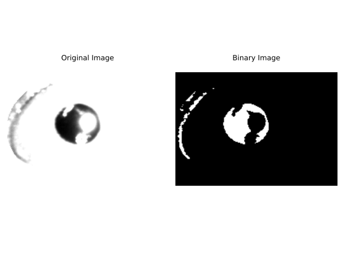

Pupil Computation
=================

Numerous studies have demonstrated the significance of pupillometry in examining brain states and cognitive functions. By measuring pupil size variations, researchers can gain insights into mental states, cognitive load, and attentional processes, making it a valuable tool in neuroscience research.

FaceIt offers an fast and precise approach for tracking pupil movement and size. Its user-friendly graphical interface makes it simple to use and facilitates effective data quality control.

Pupil Detection
^^^^^^^^^^^^^^^

The following section outlines the method used to identify and detect the pupil within a defined region of an image. This method considers potential reflections and user-defined pixel areas for removal. The output is an accurately fitted ellipse that represents the pupil's boundaries. This method can be found in the 'FACEIT_codes.Pupil_detection' directory.

.. py:method:: detect_pupil(chosen_frame_region, erased_pixels, reflect_ellipse)

Process Overview:
~~~~~~~~~~~~~~~~~

- **Defining the Region of Interest (ROI):**
  The user first defines the eye region of interest (ROI) using the GUI. The image within the selected frame is then binarized. The user has the option to adjust the saturation through the GUI, allowing direct modification of the binarization threshold.

- **Image Clustering for Pupil Detection:**
   During the binarization process, some pixels from the area surrounding the eye might meet the threshold criteria and mistakenly be included in the pupil detection. Since the pupil detection approach relies on data covariance, it is particularly sensitive to outlier data. To mitigate this issue, a clustering technique is employed after binarization to isolate and select the largest cluster (presumably the pupil) from the surrounding outlier noise.
   The function which performing this function is:

   .. py:method:: find_cluster(binary_image)

   Which can be found in the 'FACEIT_codes.Pupil_detection' directory.

.. raw:: html

   

       
       
   

   
<b>Figure2:</b> Left: Non-zero pixel coordinates utilized during the process. Right: Clustering results with the largest cluster, highlighted in pink, representing the pupil region.

- **Detecting the Pupil Area:**
  To locate the pupil, the method fits an ellipse to non-zero pixels in the binary image using the function described below:

  .. py:method:: find_ellipse(binary_image)

- **Ellipse Fitting Details:**
     In the next step FaceIt identifies non-zero pixel coordinates in the binary image to outline the area for ellipse fitting. It calculates the mean center of these coordinates and recenters them for accurate alignment. A covariance matrix is computed to evaluate the distribution of the coordinates, which defines the axes of the pupil ellipse.
     The equation below shows how the covariance between two variables,x and y, is calculated. The covariance measures the relationship between the x and y positions of the points:

    .. math::

        \text{Cov}(x, y) = \frac{1}{n - 1} \sum_{i=1}^n (x_i - \bar{x})(y_i - \bar{y})

    Where:

        - :math:`x_i` and :math:`y_i`: Individual data points for the :math:`x` and :math:`y` coordinates.
        - :math:`\bar{x}` and :math:`\bar{y}`: Mean values of :math:`x` and :math:`y`, respectively.
        - :math:`n`: Number of data points.

  - **Eigenvalue and Eigenvector Analysis:**
     The eigenvalues and eigenvectors of the covariance matrix are extracted to determine the ellipse's orientation and dimensions. The primary eigenvector indicates the major axis (width), while the secondary, perpendicular eigenvector represents the minor axis (height).

    .. math::

        \Sigma \mathbf{v}_i = \lambda_i \mathbf{v}_i

    Where:

        - :math:`\Sigma`: Covariance matrix.
        - :math:`\lambda_i`: Eigenvalue (scalar), where :math:`i = 1, 2`.
        - :math:`\mathbf{v}_i`: Eigenvector (unit vector corresponding to :math:`\lambda_i`).

    .. raw:: html

       

           
       

       
<b>Figure3:</b> Visualization of the PCA application on pupil data. The figure displays the non-zero pixel coordinates of the pupil region (purple dots) with the principal components overlaid. The first principal component (PC1, blue arrow) represents the major axis of the ellipse, while the second principal component (PC2, orange arrow) represents the minor axis. These components are derived from the covariance matrix to determine the dimensions of the pupil ellipse.

- **Including Reflection:**
   In certain experimental conditions or due to poor recording quality, light reflections may partially cover the pupil, disrupting accurate detection. To handle this challenge, the pupil detection method incorporates in this function

   .. py:method:: overlap_reflect(reflections, pupil_ellipse, binary_image)

   This function allows users to manually include reflection areas in the analysis, improving the accuracy of pupil detection by accounting for these disruptions.

   **Method Overview**:

    - **Initial Step**: The function first fits an initial ellipse to the pupil area while disregarding user-defined reflection regions.
    - **Reflection Inclusion**: The function creates a mask representing the reflection regions and checks for overlaps between the pupil ellipse and the reflections.
    - **Binary Image Update**: The function adds the overlapping coordinates to the binary image and fits a new ellipse considering these coordinates.
    - **Iteration**: This cycle is repeated four times, updating the ellipse each time to ensure that the final fitted ellipse accurately represents the pupil, even with potential reflections.

.. raw:: html

    

        

            (A)
            
        

        

            (B)
            
        

        

            (C)
            
        

    

    

        

            (D)
            
        

        

            (E)
            
        

        

            (F)
            
        

    

    

        
<b>(A)</b> Eye Frame: The original grayscale frame of the eye used for pupil detection.

        
<b>(B)</b> Binarized Pupil Area: The binary representation of the pupil area after thresholding.

        
<b>(C)</b> First Fitted Ellipse: An initial ellipse fitted to the pupil without accounting for reflections.

        
<b>(D)</b> Reflection: The detected reflection areas overlapping with the pupil region.

        
<b>(E)</b> Reflection Added to Binary Data: Reflections incorporated into the binary data for further processing.

        
<b>(F)</b> Second Fit: A refined ellipse fitted to the pupil area after accounting for reflections.

    

- **Erasing Pupil area Pixels:**
   If selecting an optimal frame for the eye is challenging and the frame includes a broader eye region, it's advisable to manually remove those pixels using the Eraser tool provided in the GUI. The Eraser function sets the value of all marked pixels to zero.

.. important::
    Avoid using the Eraser on the interior of the eyeball.

Saccade Detection
^^^^^^^^^^^^^^^^^

FaceIt also provides the ability to detect saccades or rapid eye movements. The method to decet saccade can be found in the 'FACEIT_codes.Pupil_detection' directory.

.. py:method:: Saccade(pupil_center_i)

Process Overview:
~~~~~~~~~~~~~~~~~

   - The method calculates the frame-by-frame differences in the pupil's center coordinates along a specified axis (x or y).
   - Movements with an absolute change less than 2 units are considered insignificant and are set to NaN. This step filters out minor fluctuations.

   .. important::
       To maintain consistency in dataset length, the first computed saccade value is duplicated and inserted at the beginning.

Blinking Detection
^^^^^^^^^^^^^^^^^^

FaceIt incorporates a method for detecting and handling blinking events, which can interfere with accurate pupil tracking data.
This method can have provide the frames that blinking happens there. Which can be used in the further behavioral analysis by user also it can provide a pupil dilation trace excluding blinking which ensures that sudden interruptions or noise due to blinking do not skew the analysis of pupil movement.
The main methods for this functionality are located in the FACEIT_codes.Pupil_detection directory.

.. py:method:: detect_blinking_ids(pupil_data, threshold_factor, window_size)

And

.. py:method::  detect_blinking(self, pupil, width, height, x_saccade, y_saccade)

in the FACEIT_codes.analysis directory.

Process Overview:
~~~~~~~~~~~~~~~~~

The blinking detection method utilizes two distinct strategies:

   - The first strategy focuses on variations in the pupil area.
   - The second strategy examines changes in the pupil's width-to-height ratio.

Both strategies involve computing the moving variance of the input data (either the pupil area or the width-to-height ratio) with a specified window size. This process emphasizes fluctuations in pupil size over successive data points. The method then calculates a threshold based on the range of the moving variance (the difference between its maximum and minimum values), divided by a defined threshold factor. Indices where the moving variance exceeds this threshold are identified as potential blinking events. This process is applied separately to both the pupil area and the width-to-height ratio, and the final blinking indices are obtained by combining the indices detected in both strategies.