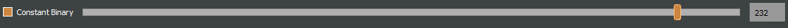

How to Use FaceIt GUI
=====================

Open data to process
^^^^^^^^^^^^^^^^^^^^

To analyze mouse face motion data, navigate to the File tab in the menu bar and select the option to open an image series **Folder** (Ctrl + N) or a video  **file** (Ctrl + V). Once selected, the images or video frames will be displayed in the GUI for analysis.

Analyse Pupil
^^^^^^^^^^^^^^

To begin pupil tracking, use the **Pupil ROI** button in the **ROI tools** section to define the eyeball region. You can adjust the position of the Pupil ROI by dragging it or resize it by clicking and dragging the blue square at its corner.

.. raw:: html

   

After selecting and adjusting the Eyeball ROI, you can use the **Eraser** option to remove pixels from the surrounding eye region. This ensures that these pixels are excluded from further analysis. The size of the eraser can be customized in the settings window.

   Example of eyeball chosen ROI.

.. raw:: html

   

   Erasing pixels from the surrounding eye region.

.. raw:: html

   

.. important::
    Don’t erase regions the pupil might cross.

Pupil Area Visualization Modes
------------------------------

FaceIt provides two ways to visualize the pupil area:

- **Normal preview** — continuous/raw pupil area trace.
- **Binary preview** — area estimated from a thresholded (binary) pupil mask.

Toggling the view
~~~~~~~~~~~~~~~~~

Use the **Show binary** checkbox to switch between modes.

.. raw:: html

   

       

           
<b>Normal preview</b>

           
       

       

           
<b>Binary preview</b>

           
       

   

Binarization methods
--------------------

You can choose how the binary mask is created. Two methods are available:

- **Global (constant) binarization**
  Applies a single threshold to the whole image.

- **Adaptive binarization**
  Computes a local threshold per neighborhood (robust to uneven illumination).

Selecting the method
~~~~~~~~~~~~~~~~~~~~

By default, **Adaptive binarization** is used.

To switch methods, use the **Constant Binary** checkbox:

- **Unchecked (default)** → **Adaptive** binarization.
- **Checked** → **Global (constant)** binarization.

When **Constant Binary** is checked, a **threshold slider** becomes active so you can set the
global threshold used for the constant method.

Threshold slider (Global binarization)
~~~~~~~~~~~~~~~~~~~~~~~~~~~~~~~~~~~~~~

   **Threshold slider** available when **Constant Binary** is enabled.

.. note::
   - In **Adaptive** mode, the global threshold slider is disabled; instead, tune
     **Block size** and **C** under *Adaptive thresholding settings*.
   - In **Constant** mode, adjust the **threshold slider** to control the binary mask.

Parameters
~~~~~~~~~~

- **Global (constant)**:

  - **Binary threshold**: the global threshold value applied to all pixels.

- **Adaptive** (see **Adaptive thresholding settings**):

  - **Block size**: odd window size for local statistics (larger → smoother, less detail).
  - **C**: constant subtracted from the local mean/weighted mean (higher ``C`` → stricter threshold).

When to use which
~~~~~~~~~~~~~~~~~

- Use **Global** when lighting is uniform and the pupil/eyeball contrast is stable.
- Use **Adaptive** when lighting is uneven, there are vignetting, or contrast varies across the frame.

Tips
~~~~

- If the binary mask looks noisy or fragmented, try:

  - adjusting **Block size** (Adaptive)
  - adjusting **C** (Adaptive)

- The **Show_binary** checkbox controls **visualization**. The chosen **Binarization method** controls **how** the mask is computed.

Reflection Correction
---------------------

Bright corneal reflections can fragment the pupil mask and bias ellipse fitting. FaceIt
handles reflections in two ways:

- **Automatic detection + inpainting** (available **only** with *Adaptive* binarization; **default**)
- **Manual reflection ellipses** (available with *Adaptive* **and** *Constant/Global*)

Defaults
~~~~~~~~

- The default **Binarization method** is **Adaptive**.
- In **Adaptive** mode, the pipeline applies **automatic reflection detection + inpainting**
  unless you provide manual ellipses.

Behavior by binarization method
~~~~~~~~~~~~~~~~~~~~~~~~~~~~~~~

+--------------------+---------------------------+-------------------------------+
| Thresholding mode  | Auto detect + inpaint     | Manual ellipses               |
+====================+===========================+===============================+
| **Adaptive**       | **Yes** (default)         | Inpaint using ellipses        |
+--------------------+---------------------------+-------------------------------+
| **Constant/Global**| **No**                    | Overlap fix (no inpainting)   |
+--------------------+---------------------------+-------------------------------+

How it works
~~~~~~~~~~~~

**Automatic (Adaptive only)**

1. Detect bright regions using a percentile threshold controlled by **Reflect br**;
   filter by area/circularity; dilate proportionally to glare size.
2. **Inpaint** the detected mask (TELEA) to remove glare before adaptive thresholding.

**Manual ellipses (both modes)**

- **Adaptive**: skip auto-detect and **inpaint** directly using the provided ellipses.
- **Constant/Global**: after thresholding/clustering, apply an **overlap fix**—pixels
  where the fitted **pupil ellipse** overlaps a **reflection ellipse** are restored to
  the pupil mask (no inpainting).

Controls & parameters
~~~~~~~~~~~~~~~~~~~~~

- **Binarization method**
  - **Adaptive** (default): uses **Block size** and **C** (subtractive constant).
  - **Constant/Global**: uses one **Binary threshold**.
- **Reflect br** (slider, *Adaptive only*): sets the brightness percentile for
  automatic detection (higher → stricter, fewer pixels marked as reflections).
- **Manual reflection ellipses** (optional): user-specified ellipse masks used as above.

   Adding reflection cover to the pupil.

.. raw:: html

   

Light Adjustment
----------------

Uneven illumination and low contrast can break the pupil mask. FaceIt provides two
complementary tools to precondition frames **before** binarization:

- **Uniform Image Adjustment** — apply the same saturation/contrast everywhere.
- **Gradual Image Adjustment** — apply a spatial brightness/saturation gradient to
  compensate vignetting or directional lighting.

At a glance
~~~~~~~~~~~

+---------------------------+--------------------------+----------------------------------+
| Tool                      | What it fixes            | Typical use                      |
+===========================+==========================+==================================+
| **Uniform**               | Low contrast overall     | Quick global boost for dark ROI  |
+---------------------------+--------------------------+----------------------------------+
| **Gradual**               | Uneven lighting/vignet.  | Brighten one side / center edges |
+---------------------------+--------------------------+----------------------------------+

Uniform Image Adjustment
~~~~~~~~~~~~~~~~~~~~~~~~

Enable with the **Uniform Image Adjustments** checkbox.

Controls
~~~~~~~~

- **Saturation**: percentage change to color saturation and value (brightness) uniformly.
- **Contrast**: multiplies contrast uniformly (e.g., ``1.3`` = +30%).

Behavior
~~~~~~~~

Internally, images are converted to **HSV**. The ``S`` and ``V`` channels are scaled by
the selected **Saturation**, then a simple **contrast** gain is applied on the BGR image.

When to use
~~~~~~~~~~~

- The whole ROI is too flat/dim, but illumination is roughly uniform.
- You want a quick global boost before trying more advanced correction.

Gradual Image Adjustment
~~~~~~~~~~~~~~~~~~~~~~~~

Enable with the **Gradual Image Adjustments** checkbox.

This mode builds a **brightness weight mask** (a 2-D gradient) and multiplies it with
the image brightness. Optionally, it can also adjust saturation non-uniformly.

Primary controls
~~~~~~~~~~~~~~~~

- **Primary Light Direction** (radio buttons): ``Up``, ``Down``, ``Left``, ``Right``
  Chooses the direction along which brightness increases.
- **Primary Brightness Curve**: curvature of the gradient (≥ 1).
  Higher values make the ramp more curved (stronger bias at the bright end).
- **Primary Brightness Gain**: final multiplicative gain at the bright end (≥ 1).

Secondary controls
~~~~~~~~~~~~~~~~~~

- **Secondary Light Direction**: ``None``, ``Horizontal``, ``Vertical``
  Adds a **symmetric concave** gain (brighter toward edges) along the chosen axis.
- **Secondary Brightness Concave Power**: shape of the concave curve (≥ 1).
  Higher = steeper towards edges.
- **Secondary Brightness Gain**: how much the edges are boosted (≥ 1).
- **Saturation**: optional multiplicative factor for saturation in Gradual mode.

Behavior
~~~~~~~~

- Builds a **primary directional mask** (linear ramp raised to *Primary Brightness Curve*).
- Optionally multiplies a **symmetric concave mask** (edges brighter) controlled by
  *Secondary* settings.
- Multiplies the HSV **V** channel by the combined mask; clamps into ``[0, 255]``.
- If *Saturation* is given, scales the HSV **S** channel as well.

Relation to binarization
~~~~~~~~~~~~~~~~~~~~~~~~

- Both **Uniform** and **Gradual** adjustments are applied **before** binarization
  (Adaptive or Constant). The goal is to present a cleaner, more separable histogram
  to the thresholding stage.
- For **Adaptive** binarization, Gradual adjustment often reduces the load on
  ``Block size`` and ``C`` by flattening large-scale illumination differences.
- For **Constant/Global** binarization, Gradual adjustment helps meet a single
  threshold across the ROI.

Clustering (Choosing the Pupil Blob)
------------------------------------

After binarization, **FaceIt** selects the pupil region from the foreground mask.
You can choose a method in:

**Options & Threshold → Clustering Method**

Available methods:

- **Simple Contour** *(default)*
- **DBSCAN*

Default
~~~~~~~

**Clustering Method:** Simple Contour (with filtering enabled)

Output is the convex hull of the selected blob (fills small holes before ellipse fit).

Simple Contour
~~~~~~~~~~~~~~

**Algorithm:**

1. Apply ``cv2.findContours`` on the binary mask.
2. *(Optional)* Filter contours by width, aspect ratio (W/H), and area.
3. Keep the largest remaining contour.
4. Draw and fill its convex hull.

**Pros**

- Fast and reliable when the pupil is already one blob.

**Notes**

- If the pupil breaks into several islands (fir example because of light reflection), consider DBSCAN.

DBSCAN
~~~~~~

**Algorithm:**

1. Take coordinates of all non-zero pixels (foreground).
2. Cluster with DBSCAN (``eps = mnd``, ``min_samples = 1``).
3. For each cluster, compute its bounding box and **optionally filter out** :
   - width > 80% of image width
   - aspect ratio W/H > 2
4. Select the largest valid cluster and fill its convex hull.

**Pros**

- Handles fragmented masks produced by glare removal or noise.

.. tip::

   **Note:** ``MND`` applies **only** when using the **DBSCAN** clustering method.

   You can change ``MND`` directly from the **Settings** window.

   - **Increase ``MND``** if the pupil mask is **broken into too many small islands**.
     A higher value makes DBSCAN merge nearby fragments into one larger cluster.

   - **Decrease ``MND``** if the algorithm **merges too much** and includes unwanted dark areas or noise.
     A smaller value keeps clusters more separated.

Quick Comparison
~~~~~~~~~~~~~~~~

+-------------------+--------------------------------+--------------------------------+-----------+
| **Method**        | **Best for**                   | **How it works (short)**       | **Speed** |
+===================+================================+================================+===========+
| Simple Contour    | Clean masks with one main blob | Find contours → (optional)     | ★★★ Fast |
| *(default)*       |                                | filter by width/aspect/area →  |           |
|                   |                                | pick largest → convex hull     |           |
+-------------------+--------------------------------+--------------------------------+-----------+
| DBSCAN            | Fragmented masks (many islands)| Cluster foreground pixels with | ★ Slower  |
|                   |                                | DBSCAN → (optional) filter     |           |
|                   |                                | wide/elongated clusters →      |           |
|                   |                                | largest → hull                 |           |
+-------------------+--------------------------------+--------------------------------+-----------+

Analyse whisker pad
^^^^^^^^^^^^^^^^^^^

To analyse Whisker pad motion energy you can start by defining your region of interest using **Face ROI** bottom in the **ROI tools** section. check **whisker pad** checkbox and click on the process bottom.
After the analysis is complete, a whisker pad motion energy plot will be displayed on the GUI. If grooming activity is present in your data, you can easily interpolate the grooming segments by setting a threshold on the y-axis of the motion energy plot. To do this, click on **Define Grooming Threshold** and select the area where you want to remove activity above the specified level. A new plot, with the grooming segments interpolated, will then be displayed.

Process data
^^^^^^^^^^^^

Once the **Pupil** and **Face (Whisker Pad)** ROIs are selected and adjusted,
you can start processing the data by checking the corresponding boxes under
**Options & Threshold** and pressing the **Process** button.

- Check **Whisker Pad** to process face motion (motion energy analysis).
- Check **Pupil** to process pupil dilation and related parameters.

Only the ROIs with their checkboxes enabled will be processed.
If an ROI checkbox is **not selected**, that data will be skipped during processing.

Data visualization in the GUI
^^^^^^^^^^^^^^^^^^^^^^^^^^^^^

After processing is finished, the computed signals are automatically displayed in the
main **GUI window** for quick inspection.

The visualization area is divided into two main plots:

- **Top panel (orange)** — *Face motion*
  Displays the motion energy trace.

- **Bottom panel (green)** — *Pupil*
  Displays the raw or filtered pupil area trace. Vertical ticks mark detected
  saccades (big ye movement).

Both panels share a common **x-axis**, representing **frame number**.

Navigation and interaction
--------------------------

- A **blue vertical line** indicates the **current frame**.
  It moves dynamically as you slide through frames with the bottom **slider**.

- The **horizontal slider** allows continuous browsing through frames.

- You can **jump to a specific frame** by entering its number in the small box
  next to the slider and pressing **Enter**.

Post-processing
^^^^^^^^^^^^^^^

After the main processing finishes, **FaceIt** provides optional post-processing
tools you can apply to clean signals and flag artifacts. All actions are **undoable**.

Detect blinking
---------------

**Idea:**

Identify blinks using (a) geometry changes (width/height ratio) and
(b) large pupil drops; replace blink segments by interpolation and mask saccades
at the same indices.

**Algorithm (short):**

1. Compute ``ratio = width / height``.
2. Detect candidate blink indices from:
   - ``ratio`` using a robust threshold,
   - pupil area using a robust threshold.
3. Union the indices, bound them to signal length, and **mask saccades** (set to
   ``NaN`` at blink indices).
4. **Interpolate** the pupil trace across those indices.

**API.**

.. code:: python

    ids = process_handler.detect_blinking(
        pupil=pupil_area, width=width, height=height,
        x_saccade=X_sacc, y_saccade=Y_sacc
    )
    # → Updates: app.interpolated_pupil, X/Y_saccade_updated

.. note::

   - Because **Detect blinking** relies on the **geometry of the detected cluster**,
     the option **“Filter Cluster”** (in *Options & Threshold → Clustering Method*)
     **should be unchecked**.
     Filtering can smooth or alter the cluster’s shape, reducing blink detection accuracy.

   - This method performs **best when using a global binarization method** rather than an adaptive one.

Filtering pupil (Hampel)
------------------------

**Idea:**

Robust outlier removal on the pupil time series using a **Hampel
filter** (rolling median ± *k*·MAD). Outlier samples are treated as blinks:
saccades are masked at those indices and the pupil is interpolated.

**Parameters.**

- ``win``: half-window size for rolling statistics.
- ``k``: outlier threshold multiplier (default ≈ 3.0).

**API.**

.. code:: python

    ids = process_handler.Pupil_Filtering(
        pupil=pupil_area,
        x_saccade=X_sacc, y_saccade=Y_sacc,
        win=15, k=3.0
    )
    # → Updates: app.interpolated_pupil, X/Y_saccade_updated

Grooming threshold
------------------

**Idea:**

When animals groom, the **face-motion** signal shows large bursts.
Define a threshold to **clip** those bursts while keeping baseline dynamics.
Clipped indices are returned for reference.

**API.**

.. code:: python

    facemotion_clean, groom_ids, thr = process_handler.remove_grooming(
        grooming_thr=threshold_value,
        facemotion=facemotion_trace
    )
    # → Also stores: app.facemotion_without_grooming

Undo actions
------------

- **Undo blinking/Filtering detection** restores the pupil trace and saccades to
  their pre-blink/pre-filter state.
- **Undo Grooming** restores the original face-motion signal (before clipping).

Saving data
^^^^^^^^^^^

When you click the **Save** button, the processing results are automatically stored in
``.npz`` files.
To save the data in **.nwb** format, ensure you select the **Save NWB** checkbox before saving.

In addition, several **visualization images (.png)** are automatically saved in the same directory
to provide a quick overview of the processed results.

To better understand what is contained in the saved files, refer to the **Output** section of this documentation.